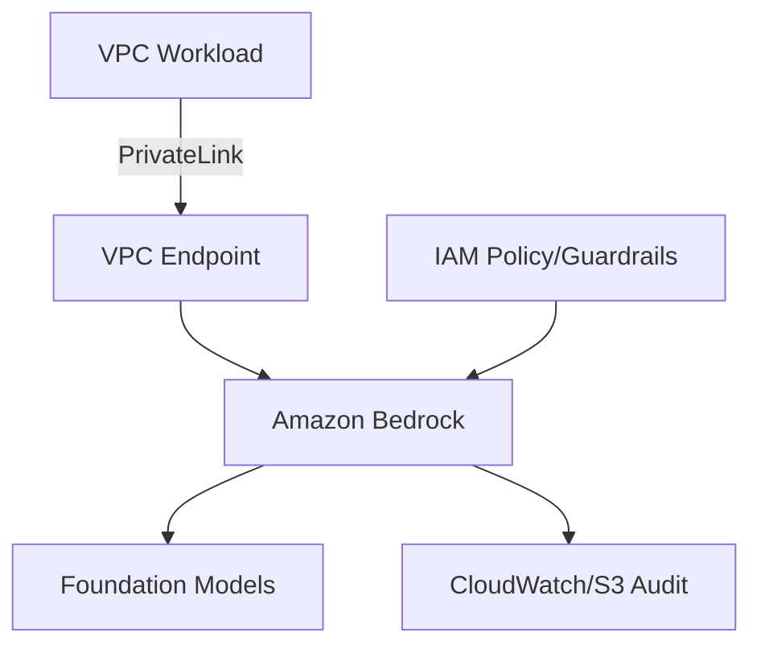

# Ravindra JOB - Cloud Architect
## Composant Landing Zone - AI (Amazon Bedrock)
### Version: v1.2

## Rôle du composant
Déploiement et orchestration de services d'IA générative via Amazon Bedrock, fournissant une interface unifiée pour l'accès aux Foundation Models (FM) tout en garantissant l'isolation des données.

## Hardening & Gouvernance
- **Isolation des données** : Désactivation explicite de l'entraînement des modèles avec les données client (Service Control Policies).
- **Contrôle d'accès** : Utilisation de rôles IAM granulaires avec conditions de tags pour l'invocation des modèles.
- **Monitoring & Audit** : Activation systématique de CloudWatch Logs et S3 pour la journalisation des invocations et des réponses (Guardrail metrics).
- **Réseau** : Accès via VPC Endpoints pour éviter tout transit par l'Internet public (PrivateLink).
- **Standards** : Alignement avec le AWS Well-Architected Framework et les principes de sécurité CNCF pour les workloads IA.

## Schéma Mermaid

## Conclusion
Adoption industrialisée du CAF avec surcouche de sécurité et intégration des pratiques CNCF.
