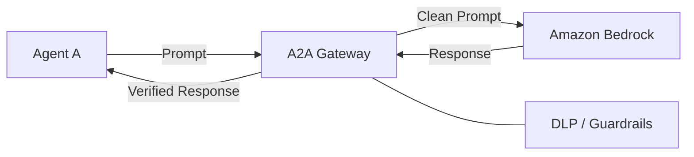

# Ravindra JOB - Cloud Architect
## Composant Landing Zone - AISecurity (A2A Gateway)
### Version: v1.2

## Rôle du composant
Passerelle de sécurité dédiée aux communications Agent-to-Agent (A2A) et à la sécurisation des échanges entre modèles d'IA, garantissant l'intégrité et la confidentialité des prompts et réponses.

## Hardening & Gouvernance
- **Proxy d'Inspection** : Interception et filtrage des requêtes vers les services d'IA pour détecter les fuites de données sensibles (DLP).
- **Authentification Forte** : Utilisation de certificats mTLS et de jetons d'identité de courte durée pour chaque agent.
- **Limitation de Débit** : Mise en œuvre de quotas et de rate limiting pour prévenir les abus et les attaques par déni de service sur les APIs d'IA.
- **Audit de Prompt** : Journalisation chiffrée des métadonnées d'invocation pour assurer la traçabilité sans compromettre le secret.
- **Standards** : Alignement avec les principes de sécurité Zero Trust et les recommandations CNCF pour les microservices IA.

## Schéma Mermaid

## Conclusion
Adoption industrialisée du CAF avec surcouche de sécurité et intégration des pratiques CNCF.
