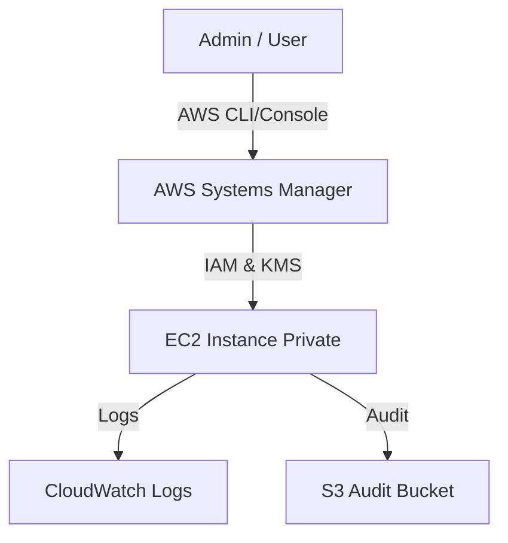

# Bastion-SSM
> **Architecture :** Fourniture d'un accès sécurisé et administré aux instances EC2 sans nécessiter d'exposition publique ou de serveurs bastion traditionnels, via AWS Systems Manager Session Manager. | **Version :** v2.3 | **Maintainer :** [Ravindra JOB](https://github.com/ravindrajob/)
---

## Hardening & Gouvernance
- **Zéro IP Publique** : Accès aux instances via PrivateLink pour SSM, éliminant le besoin d'IGW/NAT Gateway pour l'administration.
- **RBAC Strict** : Utilisation de polices IAM limitant l'accès à des tags d'instances spécifiques et forçant le chiffrement KMS de la session.
- **Traçabilité** : Enregistrement intégral des sessions (logs et streaming) dans CloudWatch Logs et S3 avec verrouillage par signature.
- **Sécurisation de l'Agent** : Configuration durcie de l'agent SSM et mise à jour automatique via State Manager.
- **Standards** : Conformité avec les recommandations de sécurité du CAF et les principes du Zero Trust Network Access (ZTNA).

## Schéma Mermaid

## Conclusion
Adoption industrialisée du CAF avec surcouche de sécurité et intégration des pratiques CNCF.
