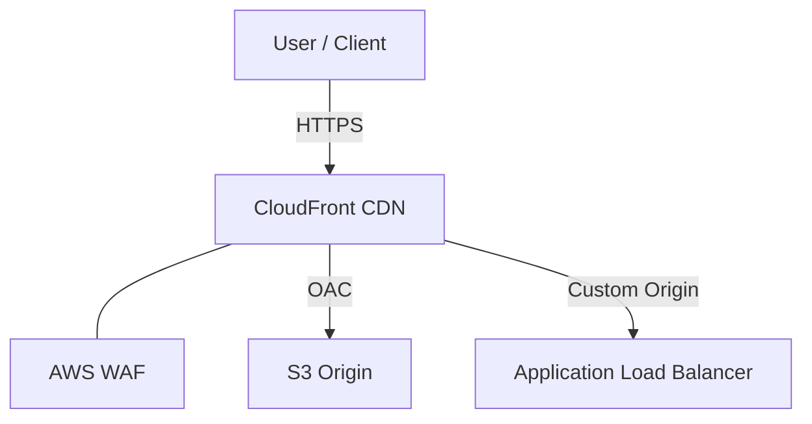

# CDN (CloudFront)
> **Architecture :** Optimisation de la livraison des contenus statiques et dynamiques via le réseau mondial de points de présence (Edge Locations) d'AWS, tout en renforçant la sécurité périmétrique. | **Version :** v2.3 | **Maintainer :** [Ravindra JOB](https://github.com/ravindrajob/)
---

## Hardening & Gouvernance
- **Protection Périmétrique** : Intégration native avec AWS WAF (Web Application Firewall) et AWS Shield pour la protection contre les attaques L7 et DDoS.
- **Sécurisation de l'Origine** : Utilisation de Origin Access Control (OAC) pour restreindre l'accès S3 uniquement à CloudFront.
- **Certificats SSL/TLS** : Utilisation systématique de HTTPS avec des protocoles TLS 1.2+ minimum (gérés via ACM).
- **Polices de Sécurité** : Headers HTTP de sécurité forcés via les CloudFront Functions (HSTS, CSP, X-Frame-Options).
- **Standards** : Conformité avec les standards de sécurité CNCF et les recommandations Edge Services du CAF.

## Schéma Mermaid

## Conclusion
Adoption industrialisée du CAF avec surcouche de sécurité et intégration des pratiques CNCF.
