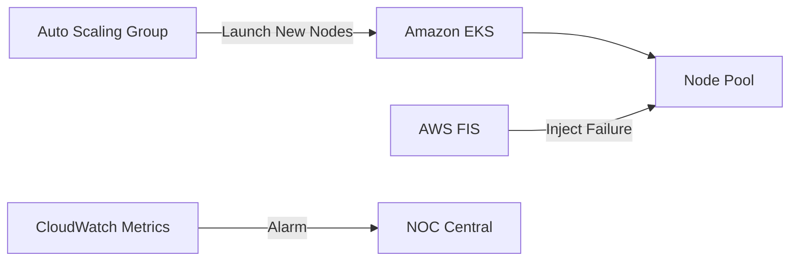

# ChaosEngineering (Fault Injection Simulator)
> **Architecture :** Orchestration de fautes via AWS FIS pour tester la robustesse des infrastructures critiques | **Version :** v2.3 | **Maintainer :** [Ravindra JOB](https://github.com/ravindrajob/)
---

## Rôle du composant
Le service **AWS FIS** permet de créer des environnements de "Chaos" pour valider les hypothèses de résilience. Ce module simule l'arrêt de 50% des nœuds d'un cluster EKS pour valider les mécanismes d'Auto-Scaling et de Self-Healing.

## Hardening & Gouvernance
- **Reliability Audit (AWS CAF) :** Mesure du MTTR (Mean Time To Recovery) lors d'un incident matériel simulé.
- **TGW Resilience :** S'assure que le routage via Transit Gateway bascule proprement en cas de perte de liens inter-AZ.
- **Zéro Downtime Objective :** Validation que les flux inspectés par AWS Network Firewall ne sont pas interrompus pendant l'expérience.

## Schéma Mermaid

## Conclusion
Adoption industrialisée du CAF avec surcouche de sécurité et intégration des pratiques CNCF.
