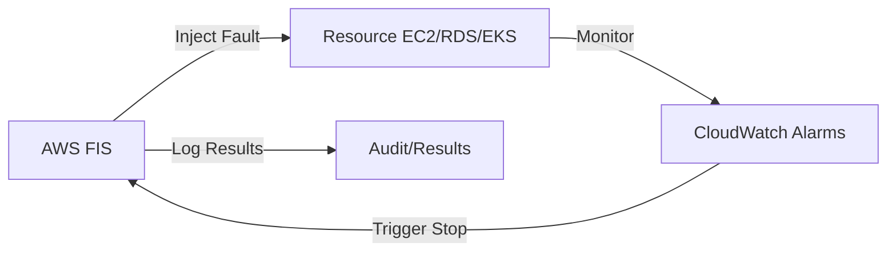

# ChaosEngineering (Fault Injection)
> **Architecture :** Mise en œuvre de tests de résilience automatisés via AWS Fault Injection Service (FIS) pour valider la robustesse de l'infrastructure face aux défaillances réelles. | **Version :** v2.3 | **Maintainer :** [Ravindra JOB](https://github.com/ravindrajob/)
---

## Hardening & Gouvernance
- **Expériences Contrôlées** : Définition de templates d'expériences limités à des environnements de staging ou de pre-prod.
- **Stop Conditions** : Configuration d'alarmes CloudWatch agissant comme des "coupe-circuits" pour arrêter immédiatement les tests en cas d'impact imprévu.
- **Isolation des Expériences** : Utilisation de rôles IAM dédiés restreignant les actions de FIS à des ressources taguées spécifiquement.
- **Audit de Résilience** : Analyse post-mortem automatique après chaque injection de faute pour améliorer les plans de reprise d'activité.
- **Standards** : Intégration des principes du "Chaos Engineering" et alignement avec le pilier "Reliability" du CAF.

## Schéma Mermaid

## Conclusion
Adoption industrialisée du CAF avec surcouche de sécurité et intégration des pratiques CNCF.
