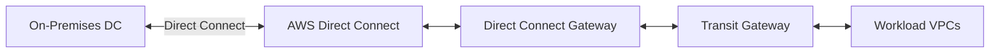

# Connectivity (Direct Connect)
> **Architecture :** Établissement d'une connexion réseau dédiée et hautement disponible entre le centre de données on-premises et l'infrastructure AWS, garantissant une latence prédictible et une sécurité accrue. | **Version :** v2.3 | **Maintainer :** [Ravindra JOB](https://github.com/ravindrajob/)
---

## Hardening & Gouvernance
- **Chiffrement** : Mise en œuvre systématique de MACsec (si disponible) ou de tunnels IPsec (VPN over Direct Connect) pour le chiffrement des données en transit.
- **Résilience** : Architecture multi-site avec diversités de ports et de routeurs (Direct Connect Gateway).
- **Contrôle de Flux** : Filtrage BGP strict et limitation des préfixes annoncés pour éviter les déviances de routage.
- **Monitoring** : Supervision des métriques de performance et d'intégrité de la liaison via CloudWatch.
- **Standards** : Alignement avec les préconisations "Hybrid Cloud" du CAF et les architectures de référence CNCF.

## Schéma Mermaid

## Conclusion
Adoption industrialisée du CAF avec surcouche de sécurité et intégration des pratiques CNCF.
