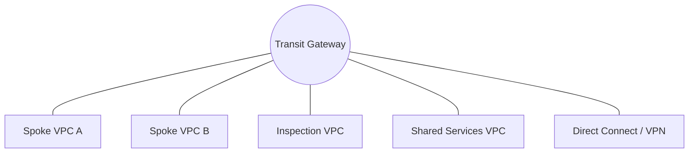

# Ravindra JOB - Cloud Architect
## Composant Landing Zone - Connectivity (Transit Gateway)
### Version: v1.2

## Rôle du composant
Hub de communication centralisé agissant comme un routeur cloud pour interconnecter les VPC, les connexions Direct Connect et les VPN, simplifiant ainsi la topologie réseau.

## Hardening & Gouvernance
- **Segmentation par Table de Routage** : Utilisation de TGW Route Tables distinctes pour isoler les environnements (Prod, Non-Prod, Shared Services).
- **Propagation Contrôlée** : Désactivation de la propagation automatique des routes pour forcer un contrôle manuel et sécurisé du routage.
- **Centralisation de l'Inspection** : Routage de tout le trafic inter-VPC et vers Internet vers un VPC d'inspection dédié.
- **RAM (Resource Access Manager)** : Partage sécurisé de la TGW à travers l'organisation AWS sans duplication de ressources.
- **Standards** : Alignement avec l'architecture "Hub & Spoke" préconisée par le CAF et les principes SDN de la CNCF.

## Schéma Mermaid

## Conclusion
Adoption industrialisée du CAF avec surcouche de sécurité et intégration des pratiques CNCF.
