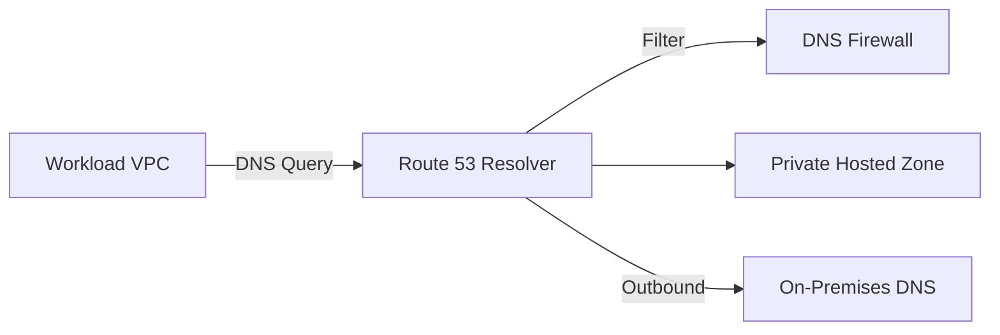

# Ravindra JOB - Cloud Architect
## Composant Landing Zone - DNS (Route 53 Private)
### Version: v1.2

## Rôle du composant
Gestion de la résolution de noms de domaine privée au sein du cloud AWS et extension de cette résolution vers les environnements hybrides via des resolvers Route 53.

## Hardening & Gouvernance
- **Isolation des Zones** : Utilisation exclusive de Private Hosted Zones associées uniquement aux VPC autorisés.
- **DNS Firewall** : Mise en œuvre de Route 53 Resolver DNS Firewall pour bloquer les requêtes vers des domaines malveillants (C&C, Phishing).
- **Architecture Hybride** : Configuration de points de terminaison entrants (Inbound) et sortants (Outbound) pour une résolution bidirectionnelle sécurisée avec le on-premises.
- **Logging & Audit** : Activation du query logging pour tracer toutes les requêtes DNS au sein de la landing zone.
- **Standards** : Respect des guides de sécurité réseau du CAF et des principes de découverte de services CNCF.

## Schéma Mermaid

## Conclusion
Adoption industrialisée du CAF avec surcouche de sécurité et intégration des pratiques CNCF.
