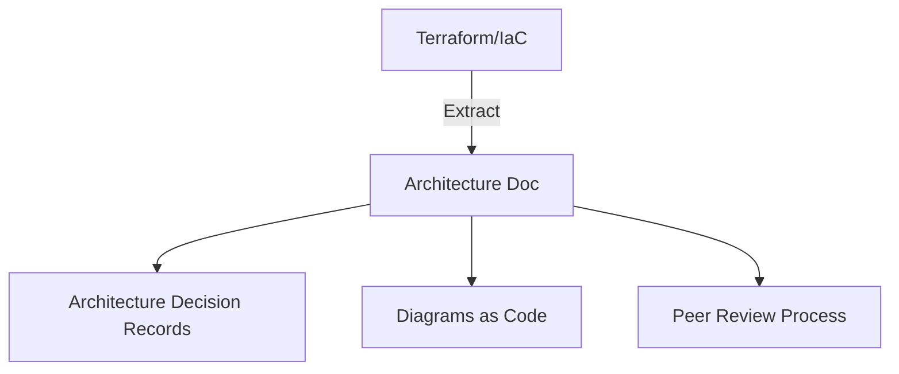

# Ravindra JOB - Cloud Architect
## Composant Landing Zone - Documentation (Architecture)
### Version: v1.2

## Rôle du composant
Référentiel centralisé de la documentation d'architecture, des diagrammes de flux et des décisions de conception (ADR) pour l'ensemble de la landing zone AWS.

## Hardening & Gouvernance
- **Versioning** : Stockage de la documentation en tant que code (Markdown/PlantUML) avec historique complet via Git.
- **Contrôle d'Accès** : Restriction de l'accès aux documents sensibles via des permissions granulaires sur le dépôt et les outils de visualisation.
- **Révision par les Pairs** : Processus de validation systématique (Pull Requests) pour toute modification d'architecture.
- **Automatisation** : Génération automatique de diagrammes à partir du code Terraform pour garantir la synchronisation avec le déploiement réel.
- **Standards** : Utilisation du framework C4 pour les diagrammes et respect des standards de documentation technique CNCF.

## Schéma Mermaid

## Conclusion
Adoption industrialisée du CAF avec surcouche de sécurité et intégration des pratiques CNCF.
