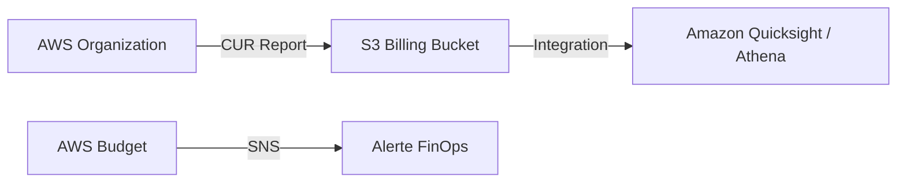

# FinOps (Cost & Usage Report)
> **Architecture :** Industrialisation de l'analyse des coûts AWS via S3 et Quicksight | **Version :** v2.3 | **Maintainer :** [Ravindra JOB](https://github.com/ravindrajob/)
---

## Rôle du composant
Ce module permet d'automatiser la collecte et l'analyse de la consommation financière du datacenter AWS. Il génère des rapports granulaires au niveau de l'organisation et déclenche des alertes préventives.

## Hardening & Gouvernance
- **Cost Data Immutability (Gouvernance) :** Les rapports CUR sont stockés dans un bucket S3 sécurisé avec Object Lock pour l'audit.
- **Budgetary Alerts (FinOps) :** Seuils d'alertes à 80% du budget mensuel pour assurer une visibilité proactive sur le "Burn Rate".
- **CAF Compliance :** Alignement sur le pilier "Cloud Financial Management" du framework AWS.

## Schéma Mermaid

## Conclusion
Adoption industrialisée du CAF avec surcouche de sécurité et intégration des pratiques CNCF.
