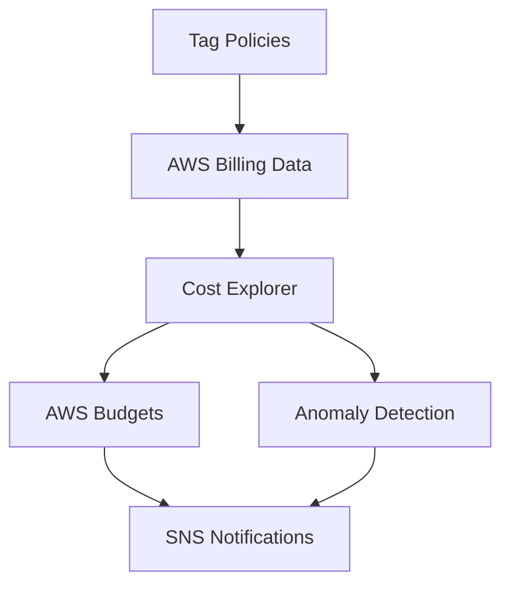

# Ravindra JOB - Cloud Architect
## Composant Landing Zone - FinOps (Cost Explorer)
### Version: v1.2

## Rôle du composant
Mise en œuvre des mécanismes de visibilité, de contrôle et d'optimisation des coûts cloud via AWS Cost Explorer et les budgets AWS.

## Hardening & Gouvernance
- **Stratégie de Tagging** : Application de polices de tagging strictes via SCPs pour garantir l'imputabilité des coûts par projet/environnement.
- **Alerting** : Configuration de budgets multi-niveaux (Réel vs Prévisionnel) avec notifications automatiques via SNS/Email.
- **Détection d'anomalies** : Activation de AWS Cost Anomaly Detection avec seuils personnalisés par service.
- **Reporting** : Dashboards automatisés pour la revue périodique des ressources sous-utilisées (Right-sizing).
- **Standards** : Intégration des principes de la FinOps Foundation et du pilier "Cost Optimization" du CAF.

## Schéma Mermaid

## Conclusion
Adoption industrialisée du CAF avec surcouche de sécurité et intégration des pratiques CNCF.
