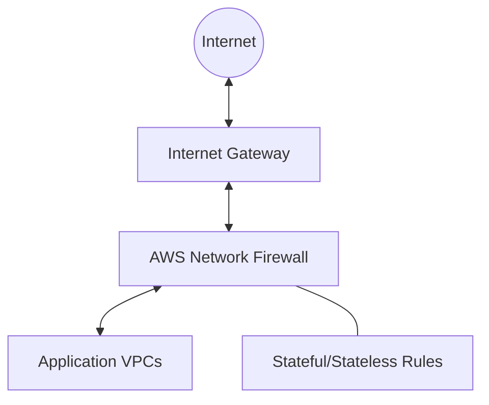

# Firewall (AWS Network Firewall)
> **Architecture :** Solution de sécurité réseau native pour AWS, offrant une visibilité et un contrôle granulaires sur le trafic entrant, sortant et interne (Est-Ouest) du cloud. | **Version :** v2.3 | **Maintainer :** [Ravindra JOB](https://github.com/ravindrajob/)
---

## Hardening & Gouvernance
- **Inspection Multicouche** : Analyse des protocoles L3-L7, incluant le support du TLS inspection pour déchiffrer et inspecter les flux HTTPS.
- **Gestion de Liste Blanche** : Application stricte de listes de domaines autorisés (Allow-list) pour restreindre l'accès vers l'extérieur.
- **Haute Disponibilité** : Déploiement multi-AZ automatique géré par AWS pour assurer la continuité de service.
- **Règles Dynamiques** : Mise à jour automatisée des jeux de règles basés sur le renseignement de menaces (Threat Intelligence).
- **Standards** : Respect des cadres de protection périmétrique du CAF et des bonnes pratiques de sécurité réseau Cloud Native.

## Schéma Mermaid

## Conclusion
Adoption industrialisée du CAF avec surcouche de sécurité et intégration des pratiques CNCF.
