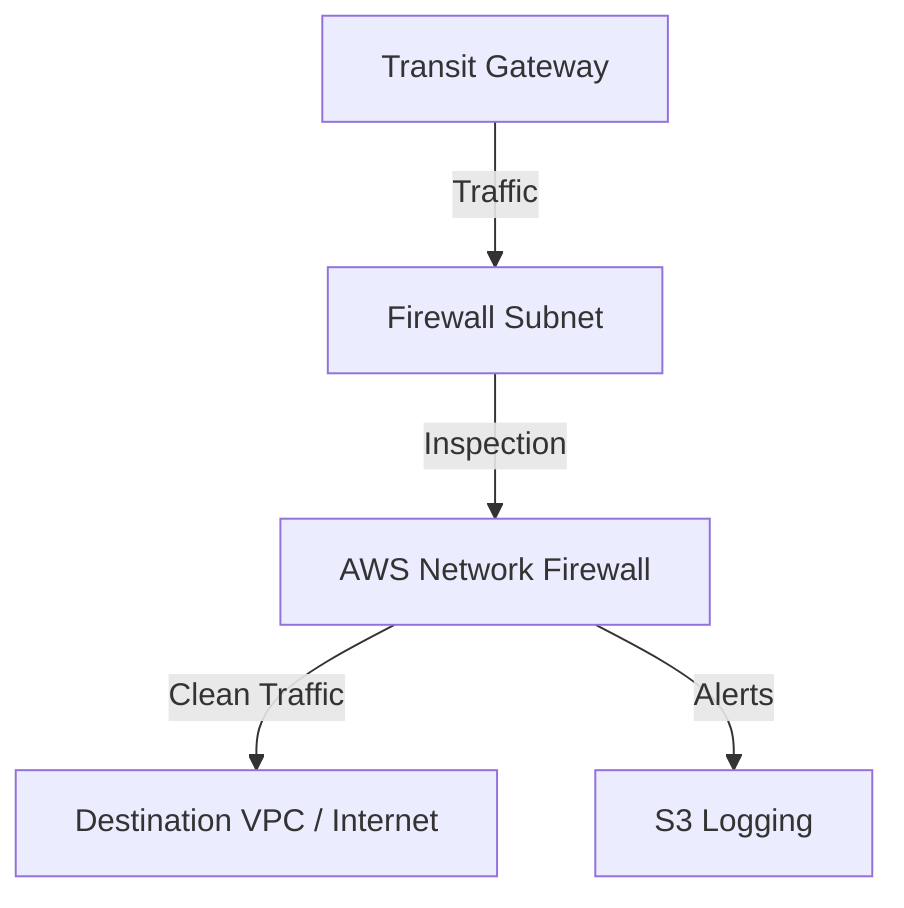

# Ravindra JOB - Cloud Architect
## Composant Landing Zone - Firewall (Network Firewall)
### Version: v1.2

## Rôle du composant
Déploiement d'un service de firewall managé pour assurer l'inspection profonde des paquets (DPI), le filtrage d'états et la prévention d'intrusions (IPS) à l'échelle du VPC.

## Hardening & Gouvernance
- **Inspection Est-Ouest & Nord-Sud** : Configuration en mode "Deployment Model: Centralized" via Transit Gateway pour inspecter tout le trafic inter-VPC et Internet.
- **Filtrage Suricata** : Utilisation de jeux de règles compatibles Suricata pour le filtrage par FQDN et la détection de signatures malveillantes.
- **Zéro Bypass** : Modification des tables de routage (Ingress Routing) pour forcer le passage par les endpoints du Network Firewall.
- **Logging Centralisé** : Exportation des logs d'alerte et de flux vers un bucket S3 sécurisé et CloudWatch Logs pour analyse SIEM.
- **Standards** : Alignement avec le pilier "Security" du CAF et les recommandations de segmentation réseau CNCF.

## Schéma Mermaid

## Conclusion
Adoption industrialisée du CAF avec surcouche de sécurité et intégration des pratiques CNCF.
