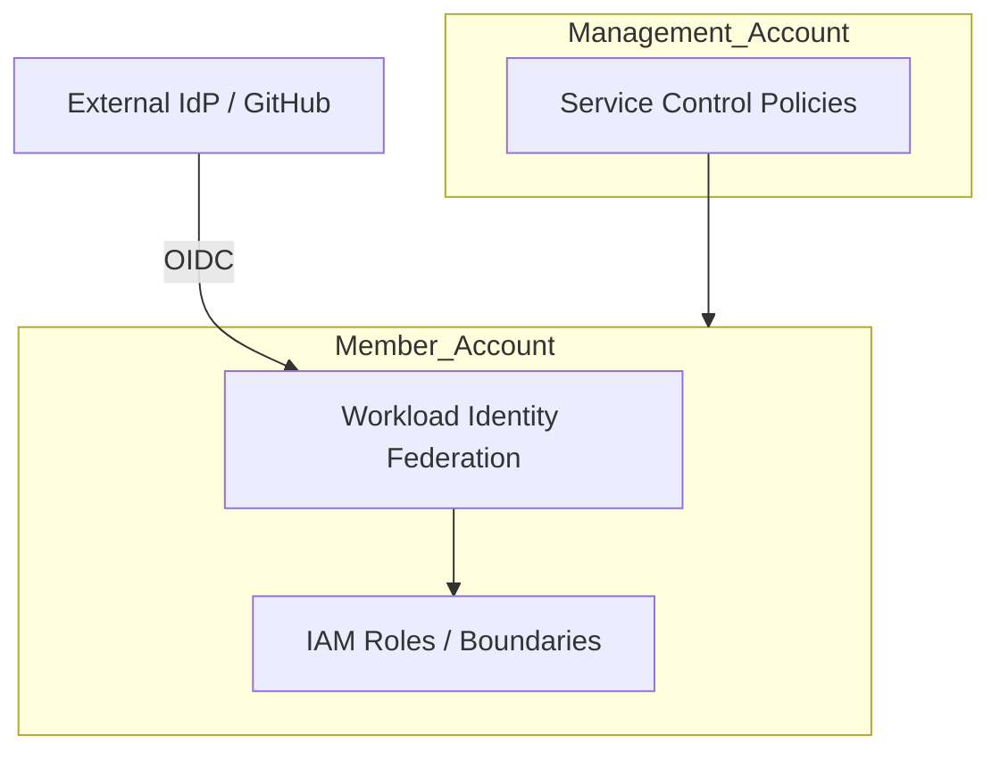

# Governance (SCPs & WIF)
> **Architecture :** Mise en place des garde-fous globaux à l'échelle de l'organisation AWS via les Service Control Policies (SCPs) et gestion de l'identité fédérée avec Workload Identity Federation (WIF). | **Version :** v2.3 | **Maintainer :** [Ravindra JOB](https://github.com/ravindrajob/)
---

## Hardening & Gouvernance
- **SCPs de Protection** : Interdiction de quitter l'organisation, blocage de la suppression des logs (CloudWatch/CloudTrail) et restriction des régions AWS autorisées.
- **WIF (OIDC)** : Élimination de l'usage de clés d'accès IAM statiques pour les pipelines CI/CD via la fédération d'identité OIDC (GitHub Actions, GitLab CI).
- **Principe du Moindre Privilège** : Définition de Permission Boundaries pour limiter les capacités d'escalade de privilèges au sein des comptes.
- **Garde-fous FinOps** : SCPs empêchant le déploiement de types d'instances coûteuses non approuvées.
- **Standards** : Application stricte du pilier "Governance" du CAF et des recommandations IAM de la CNCF.

## Schéma Mermaid

## Conclusion
Adoption industrialisée du CAF avec surcouche de sécurité et intégration des pratiques CNCF.
