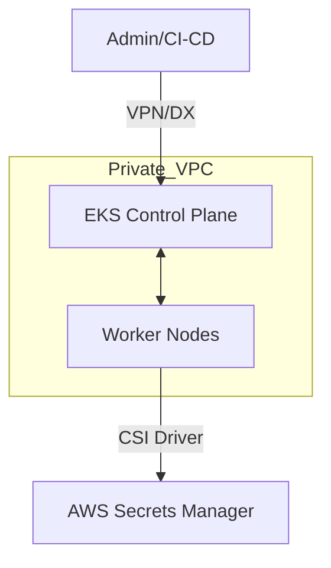

# Kubernetes (EKS Private)
> **Architecture :** Déploiement de clusters Kubernetes managés (Amazon EKS) entièrement privés, garantissant que le plan de contrôle et les nœuds ne sont pas exposés à l'Internet public. | **Version :** v2.3 | **Maintainer :** [Ravindra JOB](https://github.com/ravindrajob/)
---

## Hardening & Gouvernance
- **Private Endpoint** : Activation exclusive de l'endpoint privé pour l'API Kubernetes, accessible uniquement via VPN ou Bastion.
- **Node Groups Sécurisés** : Utilisation d'AMI durcies (AL2/Bottlerocket) et déploiement dans des sous-réseaux privés sans IP publique.
- **Secrets Management** : Intégration native avec AWS Secrets Manager via le driver CSI pour la gestion sécurisée des secrets K8s.
- **Network Policies** : Mise en œuvre du plugin VPC CNI avec support des Network Policies pour le filtrage intra-cluster (L3/L4).
- **Standards** : Respect du EKS Best Practices Guide, du CAF et des standards de sécurité CNCF (CIS Benchmarks).

## Schéma Mermaid

## Conclusion
Adoption industrialisée du CAF avec surcouche de sécurité et intégration des pratiques CNCF.
