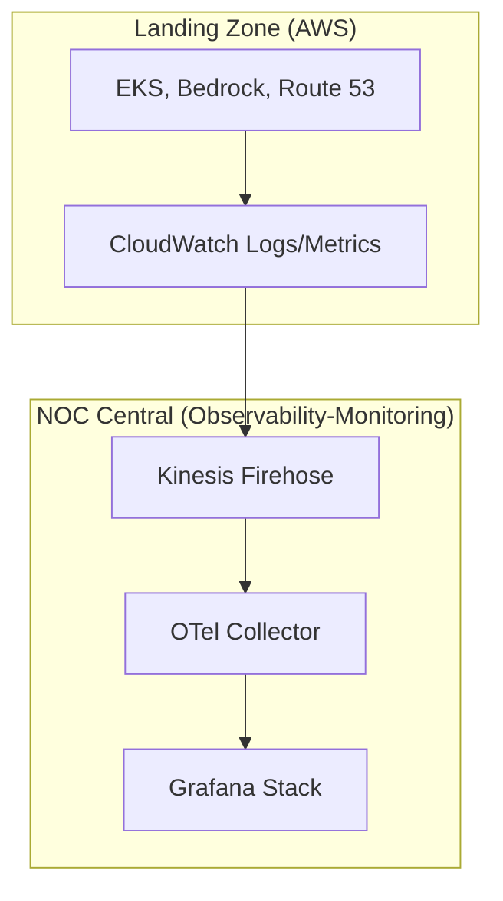

# Observability (CloudWatch) > **Architecture :** Streaming de métriques et audit de sécurité Bedrock | **Version :** v2.3 | **Maintainer :** [Ravindra JOB](https://github.com/ravindrajob/)

## Rôle du composant
Le déport de l'observabilité est une pratique fondamentale du **SRE (Site Reliability Engineering)** visant à garantir que les signaux critiques (Golden Signals) sont collectés et stockés en dehors du périmètre de production immédiat. Cette approche permet d'éviter les **SPOF (Single Point of Failure)** : en cas de compromission ou de défaillance majeure de la Landing Zone, les traces d'audit et les métriques de performance restent accessibles et intègres dans le socle de sécurité centralisé.

## Hardening & Gouvernance
La configuration applique des contrôles de sécurité rigoureux conformes aux standards industriels :
- **Audit DNS (Route 53 Resolver Logs) :** Journalisation des requêtes DNS pour la détection précoce d'exfiltration de données via des tunnels DNS.
- **Audit IA A2A (Amazon Bedrock) :** Utilisation des Guardrails et des logs d'invocation pour garantir que les agents IA respectent le cadre de sécurité **Action-to-Action**.
- **VPC Flow Logs & TGW Flow Logs :** Analyse granulaire du trafic intra et inter-VPC pour assurer la visibilité totale sur les flux réseau.
- **CloudWatch Metric Streams :** Exportation en temps-réel des métriques vers une stack d'observabilité externe via Kinesis Data Firehose (Diagnostic Settings equivalent).

## Schéma Mermaid

## Conclusion
Adoption industrialisée du CAF avec surcouche de sécurité et intégration des pratiques CNCF.
