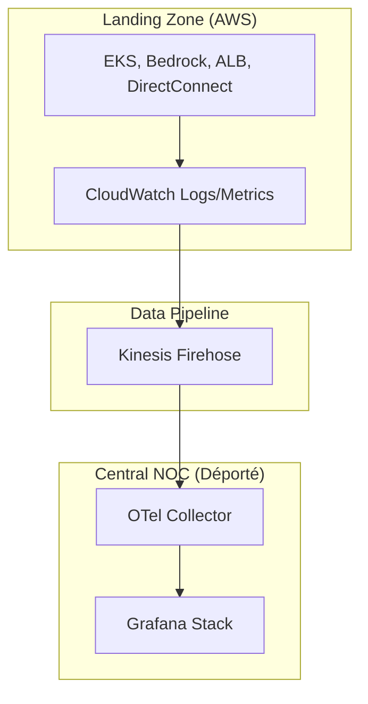

# Observability (CloudWatch)
> **Architecture :** Centralisation des flux de données AWS vers le NOC déporté | **Version :** v2.3 | **Maintainer :** [Ravindra JOB](https://github.com/ravindrajob/)
---

# Observability (AWS CloudWatch)

💡 **Rôle du composant :** 
Collecter, retenir et diffuser les signaux d'observabilité (logs, métriques) du datacenter AWS, en mettant l'accent sur le filtrage IA de Bedrock.

## Pourquoi ce choix technique ?
**CloudWatch** est utilisé comme point d'entrée natif pour toutes les briques AWS. Nous utilisons **Kinesis Data Firehose** pour streamer ces métriques en temps-réel vers notre stack d'observabilité déportée, garantissant une vision unifiée multi-cloud.

## Hardening & Gouvernance (CAF & CNCF)
- **Bedrock Guardrails Audit :** Capture exhaustive des logs de blocage d'Amazon Bedrock pour vérifier le respect du protocole **Action-to-Action (A2A)**.
- **TGW Flow Logs :** Audit de chaque flux transitant par le Transit Gateway. Essentiel pour détecter les tentatives de mouvements latéraux entre Spokes.
- **Metric Streams (OTel 0.7) :** Utilisation du format standard **OpenTelemetry** pour l'export des données, évitant tout lock-in propriétaire.

---
*Adoption industrialisée du CAF avec surcouche de sécurité et intégration des pratiques CNCF.*
