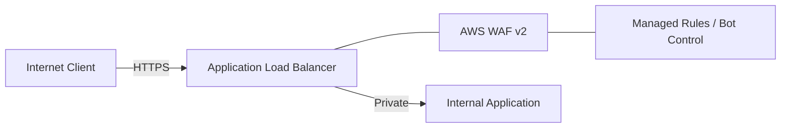

# Ravindra JOB - Cloud Architect
## Composant Landing Zone - ReverseProxy (ALB & WAF v2)
### Version: v1.2

## Rôle du composant
Gestion de l'entrée du trafic HTTP/HTTPS via l'Application Load Balancer (ALB), couplée à une protection applicative robuste via AWS WAF v2.

## Hardening & Gouvernance
- **Filtrage Applicatif** : Mise en œuvre de Web ACLs WAF v2 avec des règles gérées par AWS (Core ruleset, Known bad inputs, SQLi/XSS).
- **TLS Hardening** : Utilisation de politiques de sécurité TLS récentes (TLS 1.2/1.3) et gestion automatique des certificats via ACM.
- **Logging de Requête** : Activation des logs d'accès ALB et des logs complets WAF vers S3/Kinesis pour analyse de sécurité.
- **Rate Limiting** : Protection contre le brute-force et le scraping via des règles WAF basées sur le débit par adresse IP.
- **Standards** : Alignement avec les recommandations de protection L7 du CAF et les standards OWASP recommandés par la CNCF.

## Schéma Mermaid

## Conclusion
Adoption industrialisée du CAF avec surcouche de sécurité et intégration des pratiques CNCF.
