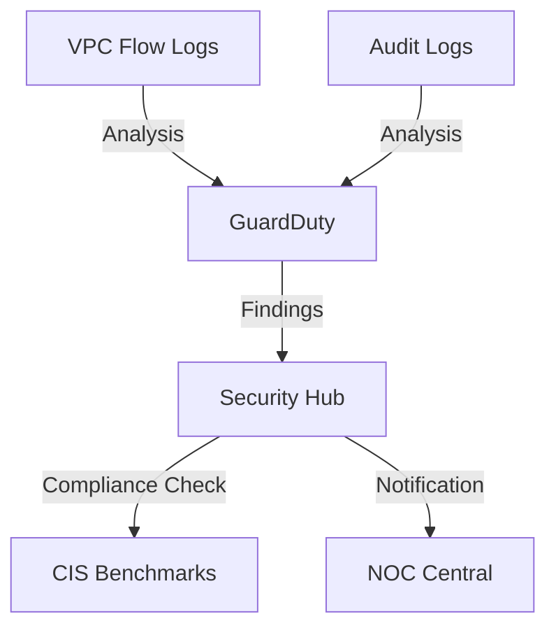

# SecOps (Security Hub & GuardDuty)
> **Architecture :** Centre opérationnel de sécurité (SOC) unifié et détection de menaces intelligente | **Version :** v2.3 | **Maintainer :** [Ravindra JOB](https://github.com/ravindrajob/)
---

## Rôle du composant
Le SOC Cloud natif de la Landing Zone AWS. Il agrège les alertes de sécurité de tous les services (EC2, S3, IAM) et vérifie la conformité du datacenter par rapport aux standards CIS et AWS Foundational.

## Hardening & Gouvernance
- **Intelligent Threat Detection (Security) :** GuardDuty analyse en continu les VPC Flow Logs et les logs DNS via Machine Learning pour détecter des comportements de C2 (Command & Control).
- **Automated Compliance (Gouvernance) :** Security Hub applique les benchmarks CIS (Center for Internet Security) et alerte sur les dérives.
- **Data Lake SOC :** Exportation des findings vers un bucket S3 de sécurité déporté pour archivage et forensic.

## Schéma Mermaid

## Conclusion
Adoption industrialisée du CAF avec surcouche de sécurité et intégration des pratiques CNCF.
