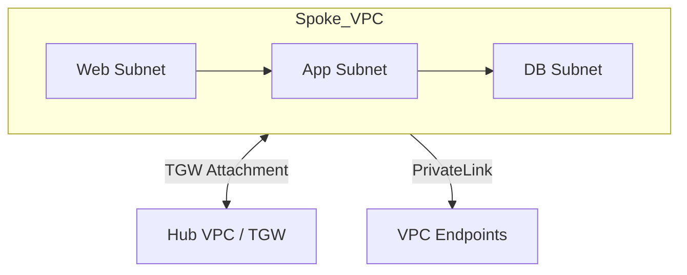

# Workloads (VPC Spokes)
> **Architecture :** Provisionnement standardisé de VPC "Spoke" destinés à héberger les applications, isolés par défaut et connectés de manière contrôlée au Hub central. | **Version :** v2.3 | **Maintainer :** [Ravindra JOB](https://github.com/ravindrajob/)
---

## Hardening & Gouvernance
- **Segmentation Stricte** : Découpage en sous-réseaux (Web, App, DB) sans aucune passerelle Internet (IGW) locale.
- **Passerelles Privées** : Accès aux services AWS uniquement via VPC Endpoints (Interface et Gateway).
- **Security Groups & NACL** : Application de règles "deny all" par défaut avec ouverture granulaire basée sur les besoins applicatifs.
- **Flow Logs** : Activation systématique de VPC Flow Logs (version 5) avec agrégation dans un compte de logging dédié.
- **Standards** : Conformité avec les blueprints de segmentation du CAF et les modèles d'isolation multi-tenant CNCF.

## Schéma Mermaid

## Conclusion
Adoption industrialisée du CAF avec surcouche de sécurité et intégration des pratiques CNCF.
